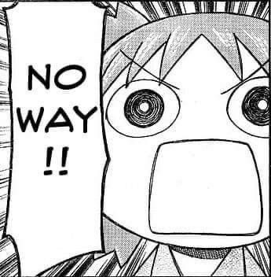
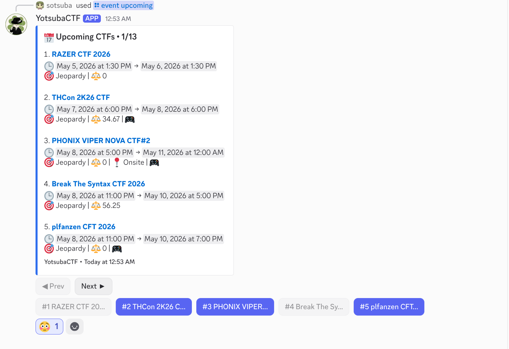
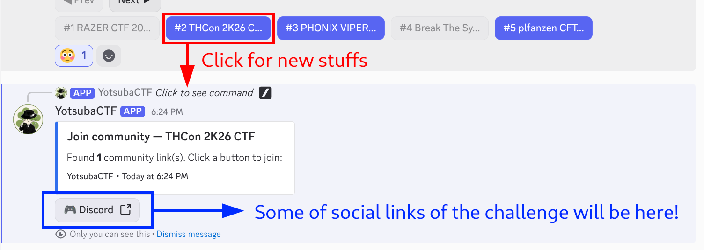
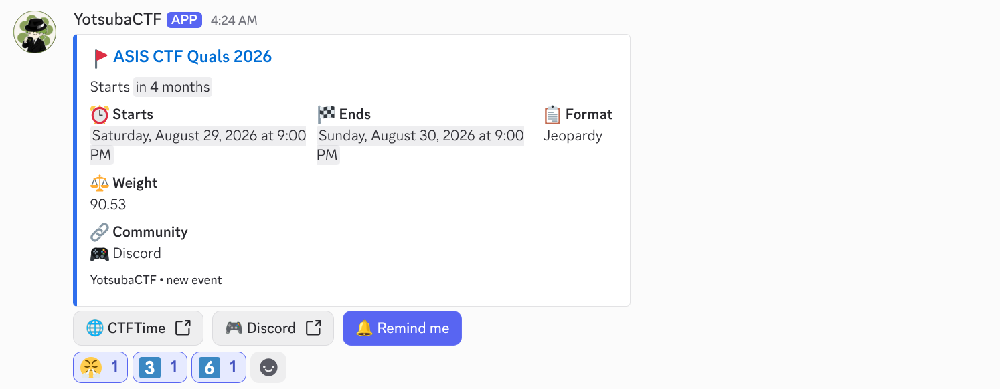
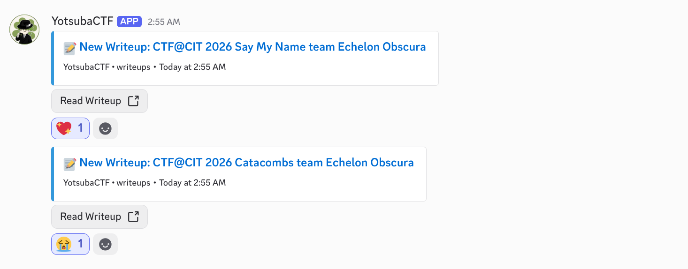
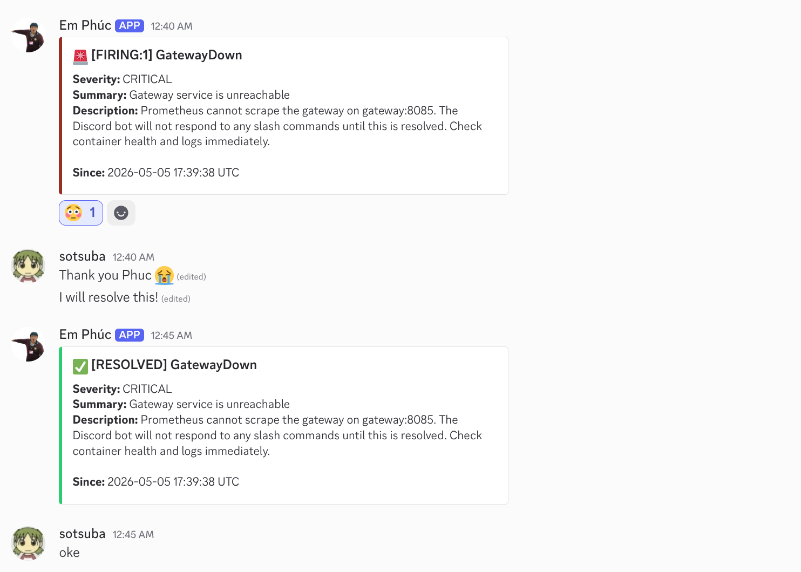
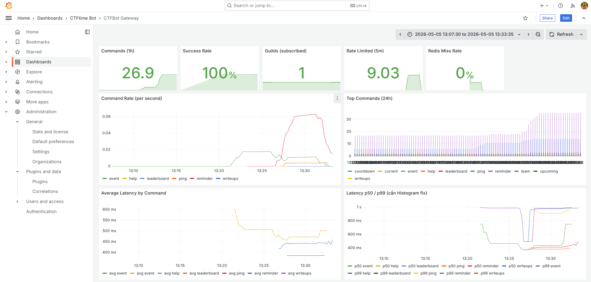

# YotsubaCTF Discord Bot


[](https://github.com/sotsuba/yotsubactf/actions/workflows/ci.yml)
[](LICENSE)
[](https://www.rust-lang.org)
> My imaginary friend hate to open CTFTime to see things 💔. I also cannot open it everyday.
>
> So I force Yotsuba do these tasks for us. 🍀


Here's the Yotsuba if you don't know who she is. She is from the manga **Yotsuba&!** (read it, it's very fun).




## What It Does

### Core CTF Ops
- Browse CTFTime events (upcoming/current/completed), plus countdown and info lookups
- Subscribe a server to event notifications with clean Discord embeds
- Send a weekly CTF digest to a chosen channel
- Search and browse writeups by keyword, event, category, or followed team
- Follow a CTFTime team and post new results
- Set reminders for events, timers, or recurring intervals

### Optional Utilities
- Cipher/encoding tools and hash calculators
- Admin role mapping for command access control

## Screenshots

### Event Commands
#### Upcoming events

#### Next steps for an event


### How updates are announced
Events and writeups are posted as separate notifications.

#### Events


#### Writeups


### How it alerts

Plug in a Discord webhook and let your server scream at you the moment your bot (or anything else) gets nuked.



### Grafana Dashboard


## Tech Stack

| Area | Tools |
| --- | --- |
| Core | Rust (2024 edition), Twilight |
| Data | PostgreSQL (SQLx), Redis, Moka |
| Observability | Prometheus, Grafana, Loki, Alertmanager, Promtail |
| Ops | Docker Compose |

## Getting Started

### Prerequisites

- [Rust](https://www.rust-lang.org/tools/install) (latest stable)
- [Docker](https://docs.docker.com/get-docker/) & [Docker Compose](https://docs.docker.com/compose/install/)
- A Discord Bot Token (from [Discord Developer Portal](https://discord.com/developers/applications))

### Quick Start

1. **Clone the repository**:
   ```bash
   git clone https://github.com/sotsuba/yotsubactf.git
   cd yotsubactf
   ```

2. **Configure environment**:
   ```bash
   cp .env.example .env
   # Edit .env and fill in DISCORD_TOKEN and DISCORD_APPLICATION_ID
   ```

3. **Start the services**:
   ```bash
   docker compose up -d
   ```

## Development, CI/CD, and Deployment

Useful files:
- [CONTRIBUTING.md](CONTRIBUTING.md): Local dev workflow, git hooks, and SQLx offline data steps
- [HOW_TO_SETUP_YOUR_BOT.md](docs/bot-setup.md): How to setup the bot in your server (Subscribe, Notifications, Team tracking)
- [API_ENDPOINTS.md](docs/api-endpoints.md): API endpoints
- [SLASH_COMMANDS.md](docs/slash-commands.md): Slash commands

Use Docker Compose for local or private hosting.

### Standard Local Dev
```bash
docker compose up -d
```

### Production (Local)

- **Production**: `docker compose -f docker-compose.prod.yml --env-file .env.prod up -d`

### Setup Notes
1. **Configure environment files**: copy `.env.example` to `.env.prod`
2. **Migrations**: run on startup inside each environment

### Monitoring

Monitoring is off by default. Enable the full stack (Prometheus, Grafana, Loki, Alertmanager, Promtail):

```bash
docker compose --profile monitoring up -d
```

Dashboards:
- **Grafana**: [http://localhost:3030](http://localhost:3030) (Default login: `admin` / `admin`)
- **Prometheus**: [http://localhost:9090](http://localhost:9090)

Gateway and Scheduler dashboards are pre-provisioned in Grafana.

## License

MIT @ sotsuba
